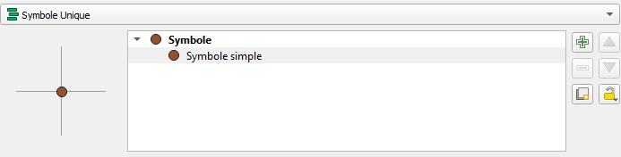
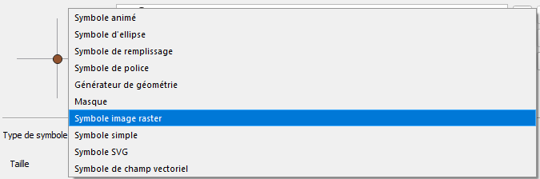
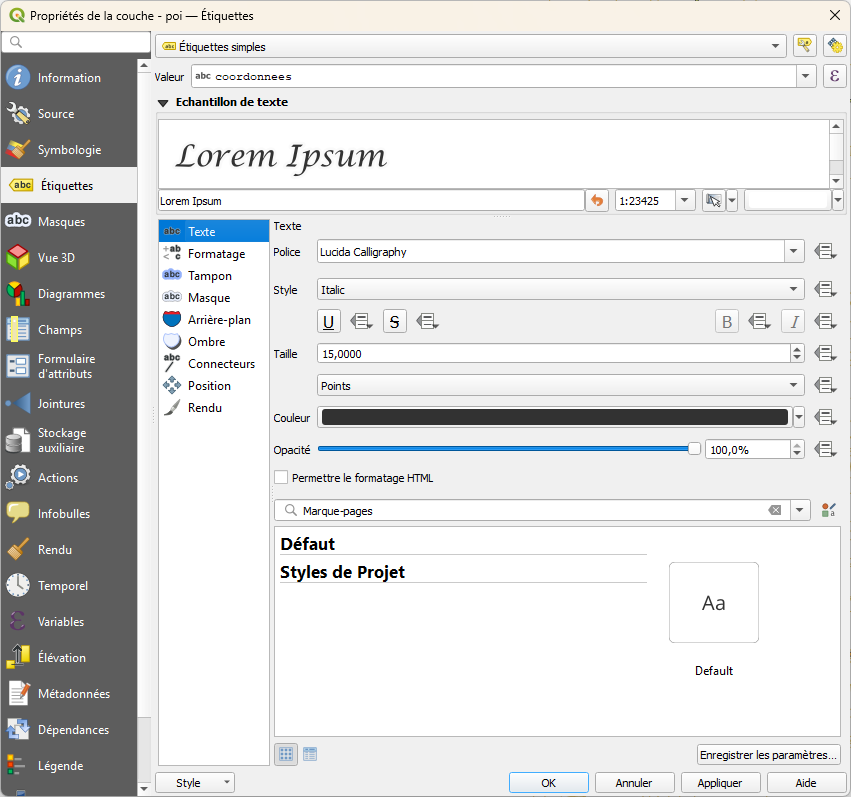
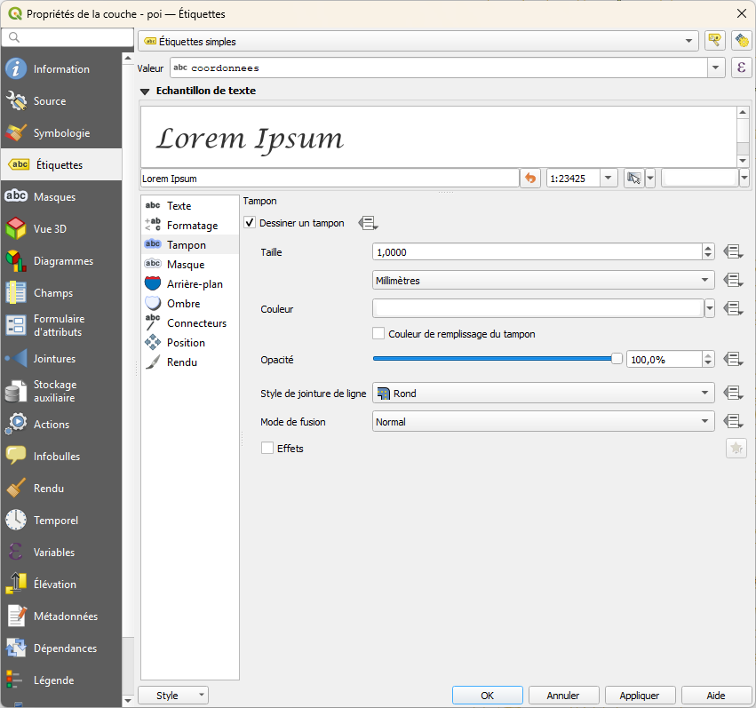
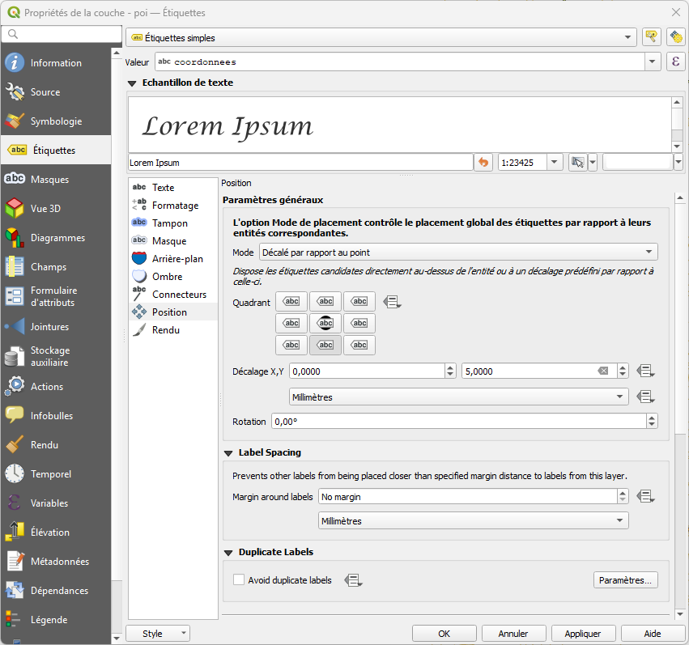
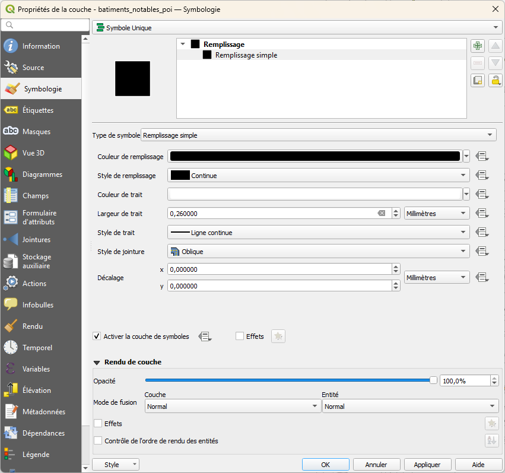
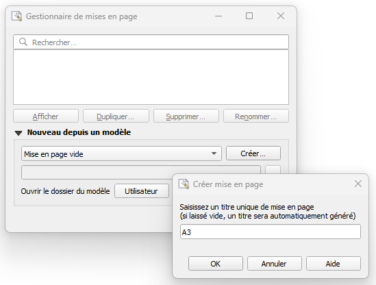
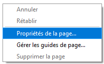
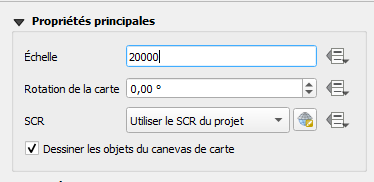
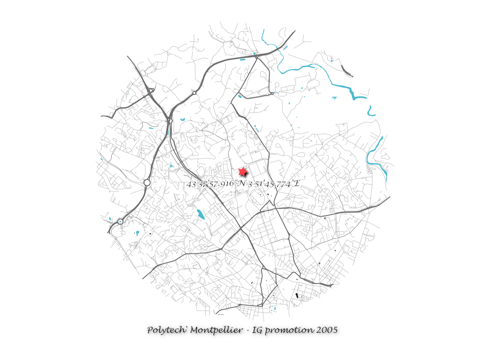

# TD optionnel

Ce contenu est sous licence [Creative Commons International 4.0 BY-NC-SA](https://creativecommons.org/licenses/by-nc-sa/4.0/deed.fr){:target="_blank"}.

[Retourner à l'accueil](../index.md)

## Objectif

L'objectif de ce TD optionnel est de créer une carte décorative centrée sur un lieu dans l'Hérault qui vous est cher.

### Etape 1

Sur Google Maps, repéré un lieu qui vous rappelle un bon souvenir. Faites alors un clic-droit sur la carte à l'endroit du lieu et cliquez sur les coordonnées afin de les copier.

Attention à l'ordre des coordonnées, Google Maps les donne en latitude (Y), longitude (X).

### Etape 2

Créez une table `poi(coordonnees, geom)` avec :
- `coordonnees` : les coordonnées WGS84 du point d'intérêt exprimées en degrés, minutes, secondes,
- `geom` : la localisation du point d'intérêt en Lambert-93.

### Etape 3

Créez une table `troncons_poi(cleabs, importance, geom)` contenant tous les `troncon_de_route` à une distance maximale de 2500 mètres du point d'intérêt.

### Etape 4

Créez une table `batiments_notables_poi(cleabs, importance, geom)` contenant tous les `batiment_notable` à une distance maximale de 2500 mètres du point d'intérêt.

### Etape 5

Créez une table `surfaces_hydrographiques_poi(geom)` qui contient l'intersection des `surface_hydrographique` avec une zone tampon de 2500 mètres autour du point d'intérêt.

### Etape 6

Dans un nouveau projet QGIS, ajoutez les couches de haut en bas dans l'ordre suivant :

* `poi`
* `troncons_poi`
* `batiments_notables_poi`
* `surfaces_hydrographiques_poi`

Le panneau "Couches" devrait alors afficher quelque chose de semblable à ceci :

Attention, pensez à sauvegarder votre projet de temps en temps, QGIS est parfois capricieux.

### Etape 7

* Téléchargez l'image disponible [à cette adresse](./images/etoile.png){:target="_blank"}.
* Ouvrez les propriétés de la couche `poi` et affichez les options de symbologie.
* Dans la fenêtre, sélectionnez le "Symbole simple".

* Dans "Type de symbole", sélectionnez "Symbole image raster".

* Appuyez sur le bouton "..." et sélectionnez le chemin vers l'image préalablement téléchargée.

* Modifiez la taille du symbole pour le passer à 8 millimètres.
* Dans "Rendu de la couche", cochez "Effets".
* Cliquez sur le bouton "* - Personnaliser les effets" et sélectionnez "Ombre portée".

* Validez en cliquant sur "OK".

### Etape 8

* Ouvrez les propriétés de la couche `poi` et affichez les options d'étiquetage.
* Choisissez "Etiquettes simples", la valeur devrait automatiquement être remplie avec "coordonnees".
* Modifiez la police et la taille du texte.

* Ajoutez un tampon blanc autour de l'étiquette.

* Positionnez l'étiquette en mode "Décalé par rapport au point" de sorte à ce qu'elle s'affiche 5 millimètres en dessous.

* Validez en cliquant sur "OK".

### Etape 9

* Ouvrez les propriétés de la couche `troncons_poi` et affichez les options de symbologie.
* Remplacez "Symbole unique" par "Catégorisé" et dans "Valeur" sélectionnez "importance".

* Cliquez 4 fois sur le "+ - Ajouter" et au niveau de la valeur des 3 premiers items, renseignez respectivement "1", "2" et "3".

* Double-cliquez sur le symbole du premier item pour en afficher les propriétés.
* Augmentez la taille à 0.8 millimètres et changez la couleur pour un gris foncé (code #707070), puis validez pour revenir aux options de symbologie.

* Faites un clic-droit sur le symbole du premier item et copiez le symbole.

* Faites un clic-droit sur les autres items et collez le symbole.

* Double-cliquez sur le symbole du dernier item (celui sans valeur) pour en afficher les propriétés.
* Diminuez la taille du symbole à 0.2 millimètres.
* Validez en cliquant sur "OK".

### Etape 10

* Ouvrez les propriétés de la couche `batiments_notables_poi` et affichez les options de symbologie.
* Modifiez les propriétés du "Remplissage simple" pour que la couleur de remplissage soit noire et la couleur du trait blanche.

* Validez en cliquant sur "OK".

### Etape 11

* Ouvrez les propriétés de la couche `surfaces_hydrographiques_poi` et affichez les options de symbologie.
* Modifiez les propriétés du "Remplissage simple" pour que la couleur de remplissage soit bleue (code #4fbbcf) et pour qu'il n'y ait pas de trait de contour.

* Validez en cliquant sur "OK".

A ce stade, le panneau "Couches" devrait être identique à ceci :

### Etape 12

Depuis le panneau "Couches", faites un clic-droit sur la couche `troncons_poi` et sélectionnez "Zoomer sur la(les) couche(s)".

Vous devriez voir dans la vue cartographique une représentation similaire à celle-ci.

### Etape 13

* Dans le menu "Projet", ouvrez le "Gestionnaire de mises en pages..." et créez une nouvelle mise en page nommée "A3".

* La création de la nouvelle mise en page devrait ouvrir automatiquement le composeur d'impression.
* Faites un clic-droit sur la page et sélectionnez "Propriétés de la page...".

* Depuis le menu "Vue", cliquez sur "Zoomer sur l'emprise totale".
* Cliquez sur "Ajouter un objet" > "Ajouter carte" et faites en sorte que l'objet prenne l'intégralité de la page.
* Faites un clic-droit sur l'objet et sélectionnez "Propriétés de l'objet...".
* Modifier l'échelle pour être au 1/20000.

* Cliquez sur "Ajouter un objet" > "Ajouter Etiquette" et positionnez là sur le bas de la page.
* Dans les propriétés de l'étiquette, modifiez le texte et la police à votre convenance.
* Vous pouvez "Exporter au format image..." depuis le menu "Projet".

